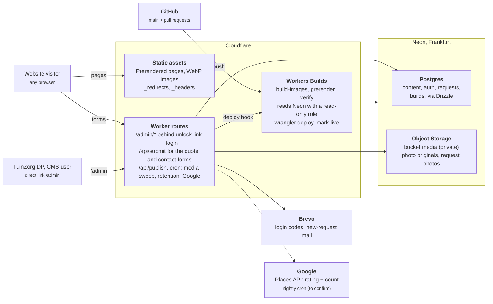

# Architecture

Visitors only ever load static files from Cloudflare. Neon is read by the build, and written only by the CMS and the two lead forms.

A save in the CMS writes to Postgres and Object Storage and leaves the live site unchanged. **Publiceren** calls the deploy hook; Workers Builds reads Neon, prerenders every page, copies the images and deploys new static assets. The only moving parts at request time are the Worker routes behind `/admin` and `/api`.

Two differences from TNL:

- **Visitors upload files.** The quote form accepts up to five garden photos. They go to the private bucket under `requests/`, are only ever shown inside `/admin`, and are deleted with the request (see [Media](04-media.md)).
- **Google rating without Google on the page.** If the Places API is approved (see [Decisions and open items](12-open-items.md)), a nightly Worker cron reads the rating and review count, stores them in `settings`, and republishes only when they changed. The build reads them from Neon like any other content. Visitors never call Google, so there is no Google script or cookie on the public site; the map loads only after a click.
