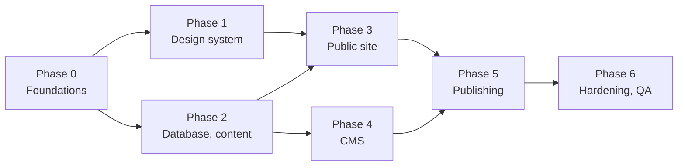

# Phases and tasks

Seven phases, the same shape as TNL. After phase 0, phases 1 and 2 can run side by side, and so can phases 3 and 4. Each task is done only when its criterion holds, checked by someone other than the author.

The public site (phase 3) needs both the components and the content; the CMS (phase 4) needs the content and uses the components for its preview. Publishing (phase 5) needs both. Code from TNL is copied in at the start of each phase where this plan says "as TNL".

## Phase 0: Foundations

- [ ] Add the SvelteKit + TypeScript app with `@sveltejs/adapter-cloudflare` to the existing repository, next to `design-system/`. Done when `npm run dev`, `npm run check` and `npm run build` pass on a clean clone, and `design-system/` is untouched.
- [ ] Create the Neon project (Free plan) in `aws-eu-central-1` with branches `main` and `dev`, the roles `tz_app`, `tz_build` and `tz_backup`, autoscaling capped at 0.25 CU and usage e-mails on. Done when all three roles connect, and `tz_build` and `tz_backup` are both refused an `INSERT`.
- [ ] Create the `media` bucket (private) and two storage credentials (read/write, read-only). Done when a script uploads, reads and deletes a test file with the first, and the second is refused a write.
- [ ] Create the Worker `tuinzorgdp-website`, connect Workers Builds to the repo, set all variables and secrets. Done when a push to `main` deploys a hello page to `*.workers.dev` and a pull request gets a preview URL.
- [ ] Add GitHub checks for `check`, `lint` and unit tests on every pull request. Done when a failing check blocks the merge.
- [ ] Create the R2 buckets `tz-backups` (30-day lifecycle rule) and `tz-media-mirror`, plus `db-backup.yml` and `media-mirror.yml`. Done when a manual run of each puts a dump and a copy of the test file in R2.
- [ ] Start Brevo domain authentication for `tuinzorgdp.be` and send the client (or whoever holds the DNS) the DKIM and verification records. Done when Brevo shows the domain as authenticated. This waits on the client; nothing else in phase 0 does.
- [ ] Send the client the content checklist (see [Decisions and open items](12-open-items.md)). Done when it is sent; answers are needed by phase 2.

## Phase 1: Design system in Svelte

- [ ] `scripts/sync-design-system.ts` copies `design-system/css/tokens.css` and `tz.css` and the two fonts into `src/lib`, and the root layout loads them. Done when a page renders in Bricolage Grotesque and Figtree on the sage background, and the build fails if the copies drift.
- [ ] Port the 20 components (`design-system/components/`) to Svelte with the props in `design-system/guide/5-cms.md`, plus the composites `ServiceGrid`, `GalleryShot`, `Lightbox`, `QuoteForm`, `ContactForm`, `ServiceTiles` and `AboutSplit`. Done when a dev-only route `/dev/components` renders each one matching `styleguide.html` at 1440, 768 and 390 px.
- [ ] Rebuild `home-page.html` as a dev route from the Svelte components with the design system's sample data. Done when it matches the HTML page section by section at the same three widths.
- [ ] Replace `tz.js` with Svelte actions (drawer, scroll shadow, gallery filter, lightbox, tabs, counter, drop zone). Done when keyboard use works as in the style guide: Escape closes the drawer and the lightbox, arrow keys move in the lightbox and the tabs, focus returns to the opener.
- [ ] Port the logo SVGs and the icons (Lucide, `mower`, `grass`, the brand marks) as components. Done when no icon is loaded through ``.
- [ ] Update `design-system/guide/5-cms.md` to point at [Database schema](03-database.md). Done when the two agree.

## Phase 2: Database and content

- [ ] Write the Drizzle schema for all tables in [Database schema](03-database.md), and generate the first migration. Done when it applies cleanly to an empty `dev` branch and is committed.
- [ ] Add the Better Auth tables with its CLI. Done when they are part of the same migration history.
- [ ] Write `scripts/seed-content.ts` with the real content: the seven services, the home blocks, the FAQ answers, the contact details, and whatever the checklist has returned. Done when running it twice leaves the same rows.
- [ ] Write `scripts/import-photos.ts` for the 45 client photos with their alt text and categories, grouped into draft projects. Done when every photo is in the bucket with a `media` row and alt text, and the drafts show in the CMS once phase 4 starts.
- [ ] Crawl the current tuinzorgdp.be (pages, anchors that were linked externally, `wp-content/uploads` images) and seed `redirects`. Done when every URL found has a redirect target or a note saying why not.
- [ ] Write `content.ts` with typed read functions and the `seed.json` fallback. Done when `npm run build` succeeds with and without `DATABASE_URL_BUILD`.

## Phase 3: Public site

- [ ] Build every route in [Public site](06-public-site.md) from Neon content. Done when the build output has a static HTML file for every route, the Worker is not invoked for them, and sections with no content (reviews, social, a gallery for an empty area) are hidden rather than empty.
- [ ] `build-images.ts`: WebP variants, `srcset`, `sizes` per slot, focal points and gallery ratios from the photo size. Done when no image is larger than 2400 px, every `` has width, height and alt, and the masonry staggers on the home page.
- [ ] Werkgebied landing pages. Done when each published area has its own page with its own intro, title and description, and appears in the footer, the sitemap and `areaServed`.
- [ ] SEO: meta, canonical, JSON-LD, sitemap, robots, `_redirects`. Done when `verify-build` asserts title and description lengths, the JSON-LD types per page, the NAP identical on every page, and every redirect answers 301.
- [ ] `/api/submit` for both forms: honeypot, Turnstile, rate limit, validation, photo upload, mail first, visitor confirmation, the no-JS fallback. Done when a quote sent with JavaScript off lands on `/bedankt` and appears in `requests` with its photos; the sixth submission from one IP within 10 minutes is refused; a 30 MB upload is refused with a Dutch message; and with `DATABASE_URL` pointing at a stopped branch, the notification still arrives.
- [ ] Cloudflare Web Analytics and the click-to-load map. Done when the browser shows no cookies after loading every public page without interaction.

## Phase 4: CMS

- [ ] Unlock-link gate, then Better Auth e-mail + password + e-mail OTP; sign-up off; `seed-account` (as TNL). Done when an anonymous request to `/admin` gets a bare 404, a wrong code is refused, and after the lockout threshold the account locks.
- [ ] Admin layout, Overzicht dashboard, Account. Done when the dashboard counts and content gaps match the database.
- [ ] **Aanvragen**: list, filters, detail with photos through signed URLs, status, call / mail / WhatsApp buttons, delete, CSV export. Done when a request with five photos shows them all, a signed URL stops working after 5 minutes, and deleting a request deletes its objects.
- [ ] Editors for Pagina's, Diensten, Realisaties (with the photo roles and the home-gallery switch), Reviews, FAQ, Werkgebied and Social, with preview and the publishing guards. Done when every field of every table can be edited, each guard blocks publishing with a Dutch message, and the preview matches the built page.
- [ ] Google screen: the Places cron and *Nu vernieuwen*, or the manual fields, depending on the decision. Done when a changed rating reaches the live hero after one publish.
- [ ] Media library, upload flow and deletion rules (as TNL). Done when replacing a photo deletes the old object, a file still in use cannot be deleted, and the sweep removes a file left unused for 24 hours.
- [ ] Instellingen, SEO & redirects. Done when changing the phone number in Instellingen changes it on every page, in the JSON-LD and in the footer after publishing.

## Phase 5: Publish pipeline

- [ ] `/api/publish`, the `builds` table, `build-info.json`, `mark-live`, the publish banner, and the Google cron trigger (as TNL). Done when the full cycle (edit, save, publish, live) is shown correctly, a build forced to fail shows *Mislukt*, a double click starts one build, and the cron starts no build when nothing changed.

## Phase 6: Hardening and QA

- [ ] `_headers`, `kit.csp` in `hash` mode, the 03:00 cron for retention with its photos. Done when securityheaders.com grades the preview A or better, the console shows no CSP violations on any page or CMS screen (Turnstile, analytics and the map included), and a request dated 13 months back disappears with its objects after the cron runs.
- [ ] Rehearse a restore: load last night's dump into a scratch branch, and restore one photo from the mirror. Done when the restored branch builds the same site, and the steps are in `HANDOVER.md`.
- [ ] Run the checks in [Testing and handover](11-testing-and-handover.md). Done when all pass on the production `*.workers.dev` URL.
- [ ] Write `README.md` and `HANDOVER.md` (how to publish, reset the password, restore a backup, rotate the unlock key). Done when someone who did not build it can do all four from the documents alone.
